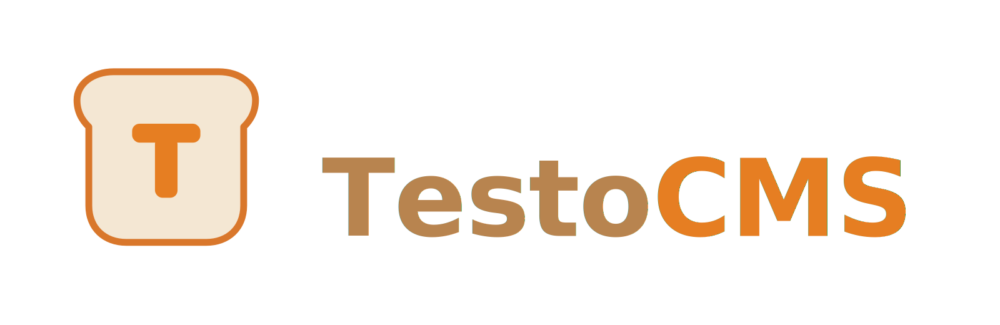

<p align="center">
  
</p>

<p align="center">
  Modern, SEO-first CMS built on Laravel 11 with a modular monolith architecture.
</p>

TestoCMS combines a modular monolith core with Content and Admin APIs, RBAC, block-based pages, a WYSIWYG editor, comprehensive SEO tools (sitemap, robots, canonicals), LLM draft generation, and full-page caching.

## Features

- **Built on Laravel 11 (PHP 8.2+)**: Modern, secure, and fast.
- **Modular Monolith**: Extensible architecture (`app/Modules/*`) for easy customization and decoupled features.
- **Content Model**: Posts, Pages, Categories, and Assets with localizations.
- **SEO Core**: Canonical URLs, robots directives, slug history/redirects, XML sitemaps, and RSS feeds.
- **Headless & Monolith APIs**:
  - Public Read-only Content API (`/api/content/v1/*`)
  - Private Admin Write API (`/api/admin/v1/*`)
- **First-run Setup Wizard**: Interactive installation experience via web or CLI.
- **Auth & Security**:
  - Session auth for the `/admin` interface
  - Sanctum Personal Access Tokens for API
  - Spatie Roles & Permissions, Policies, and Audit Logs
  - Strict HTML sanitization and CSP/security headers
- **LLM Integration**:
  - Support for multiple providers (OpenAI, Anthropic) for draft generation.
- **Operations**:
  - Publish scheduling (Cron or fallback via web requests)
  - Content revisions and preview tokens
- **OpenAPI**: Baseline spec available in `openapi/openapi.yaml`

---

## 🚀 Installation Options

TestoCMS supports shared hosting as the primary production path, Docker on VPS as a secondary production path, and separate local development tooling. The bundled local Docker stack is not the same thing as the production Docker/VPS profile.

### Option 1: Shared Hosting (cPanel, ISPmanager, etc.)

Recommended production path for v1.

1. Download the latest `testocms-vX.Y.Z-shared-hosting.zip` from GitHub Releases.
2. Upload and unpack it above `public_html`.
3. Point your domain document root to the `public/` directory.
4. Create an empty database and database user in your hosting control panel.
5. Open the site in a browser and complete the setup wizard.
6. Add a cron job for `php artisan schedule:run`.

> 📚 For a full step-by-step generic guide including cron jobs and optimization, see [docs/shared-hosting-deploy.md](docs/shared-hosting-deploy.md).

### Option 2: Docker / VPS

Production option for your own VPS with Docker Compose. This is separate from the local development stack.

1. Prepare a production `.env` from the VPS template:
   ```bash
   cp .env.vps.example .env
   ```
2. Set your domain, secrets, and database password in `.env`.
3. Start the VPS stack:
   ```bash
   docker compose -f docker-compose.vps.yml up -d --build
   ```
4. Complete installation through the web setup wizard or via CLI:
   ```bash
   docker compose -f docker-compose.vps.yml exec app php artisan cms:setup
   docker compose -f docker-compose.vps.yml exec app php artisan storage:link
   docker compose -f docker-compose.vps.yml exec app php artisan config:cache
   docker compose -f docker-compose.vps.yml exec app php artisan route:cache
   docker compose -f docker-compose.vps.yml exec app php artisan view:cache
   ```

> 📚 Production Docker runbook: [docs/docker-vps.md](docs/docker-vps.md).

### Option 3: Local Development

#### Local Docker (dev-only)

1. Prepare your local Docker env:
   ```bash
   cp .env.docker.example .env.docker
   ```
2. Build and start the local stack:
   ```bash
   docker compose up --build -d
   ```
3. Open:
   - **Frontend**: `http://localhost:8080`
   - **Admin Login**: `http://localhost:8080/admin/login`

> 📚 Local Docker guide: [docs/docker.md](docs/docker.md).

#### Local Artisan

1. Install Composer and NPM dependencies:
   ```bash
   composer install
   npm ci && npm run build
   ```
2. Start the local server:
   ```bash
   php artisan serve
   ```
3. Open your local site (e.g., `http://127.0.0.1:8000`).
4. The **Setup Wizard** will launch immediately to help you configure your local `.env`, database, and admin account.
   > **CLI Alternative**: You can run `php artisan cms:setup` to run the interactive installer in your terminal instead of the browser.

---

## Administration

The backend interface is accessible at `/admin/login`. Included admin UI sections:
- Dashboard
- Pages (CRUD, publishing, scheduling, previews)
- Posts (CRUD, categories, assets, publishing, scheduling, previews)
- Categories (CRUD)
- Assets (Upload, metadata, inline injection)
- Audit Log

## Main Commands

```bash
# Interactive CMS Setup (Web wizard alternative)
php artisan cms:setup

# Run PHPUnit tests
php artisan test

# Rebuild DB with fresh migrations and seeds
php artisan migrate:fresh --seed

# Manually trigger the publish scheduler
php artisan cms:publish-due

# Create an API token (PAT) with granular scopes
php artisan cms:token:create <admin-email> integration --abilities=posts:write,pages:write,llm:generate
```

## API Overview

### Content API (Read-only)
- `GET /api/content/v1/posts`
- `GET /api/content/v1/posts/{slug}`
- `GET /api/content/v1/pages`
- `GET /api/content/v1/categories`
- `GET /api/content/v1/assets`

*If `CMS_CONTENT_API_KEY` is set, authenticate by passing the key via the `X-API-Key` header or `?key=` query param.*

### Admin API (Write)
- CRUD endpoints for posts, pages, categories, and assets.
- Workflow operations: `publish`, `unpublish`, `schedule`.
- LLM generation:
  - `POST /api/admin/v1/llm/generate-post`
  - `POST /api/admin/v1/llm/generate-page`
  - `POST /api/admin/v1/llm/generate-seo`

*Requires a Sanctum bearer token belonging to a user with the corresponding RBAC permissions.*

## Updating the CMS 🔄

TestoCMS has a robust built-in OTA (Over-The-Air) update system located in the Admin Panel under **Settings -> Updates**. 

To leverage this and avoid contradictions when self-hosting:
1. When you push a new release tag (`v1.0.1`) to your GitHub repository, the included **GitHub Actions** workflow (`.github/workflows/release.yml`) will automatically compile frontend assets, remove dev dependencies, and build a production-ready `.zip` archive.
2. Download this `.zip` from the GitHub Releases page.
3. In your TestoCMS Admin panel, go to **Settings -> Updates -> Upload Manual Package**.
4. Upload the zip file. The CMS will safely back up your current state, apply the new files, run necessary migrations, and verify the installation. 

*If anything goes wrong, you can safely rollback from the same interface.*

## Architecture Summary
- `app/Modules/Core`: Contracts, DTOs, and core baseline services
- `app/Modules/Content`: Block renderers, slug resolvers, content domain logic
- `app/Modules/SEO`: SEO resolving and structured JSON-LD data factory
- `app/Modules/LLM`: Model providers (`openai`, `anthropic`) and gateway
- `app/Modules/Ops`: System audit logging and scheduling tasks
- `app/Modules/Caching`: Full-page caching mechanism
- `app/Modules/I18n`: Locale resolution and content translation

## Notes
- Current Laravel vendor config may emit PHP 8.5 deprecation notices for `PDO::MYSQL_ATTR_SSL_CA`. This is an upstream behavior and does not block functionality.
- Tests (and Github Actions) run predominantly on an SQLite in-memory database to verify framework integrity.

## Before Production
- Generate and store your own secrets: `APP_KEY`, `CMS_CONTENT_API_KEY`, database credentials, admin password, mail credentials, and LLM keys.
- Keep `CMS_SEED_DEMO_CONTENT=false` outside local development.
- Shared hosting baseline uses `QUEUE_CONNECTION=sync` plus cron for `schedule:run`.
- Docker/VPS baseline uses `QUEUE_CONNECTION=database` plus a supervised queue worker.
- Configure backups, monitoring, and log shipping before exposing the admin publicly.
- Treat `docker-compose.yml` as local-only. Use `docker-compose.vps.yml` only for the Docker/VPS production path.

## Support and Security
- Public bugs and feature requests: GitHub Issues
- Private / commercial / maintainer contact: [me@ilindberg.ru](mailto:me@ilindberg.ru)
- Security reports: follow [SECURITY.md](SECURITY.md) and use private email disclosure, not public issues

## License
TestoCMS source code is commercially usable under the [Apache-2.0 license](LICENSE).

The `TestoCMS` name, logo, and branding are governed separately by [TRADEMARKS.md](TRADEMARKS.md). Public forks and redistributions should preserve attribution notices and use factual wording such as `Based on TestoCMS` rather than presenting themselves as the official TestoCMS product.

Official SVG brand assets used by this repository live in [`public/brand`](public/brand) together with [`public/favicon.svg`](public/favicon.svg).
