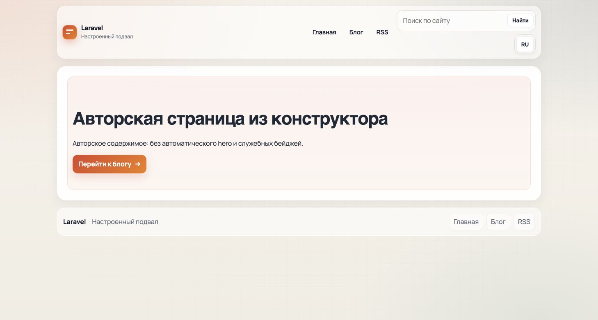
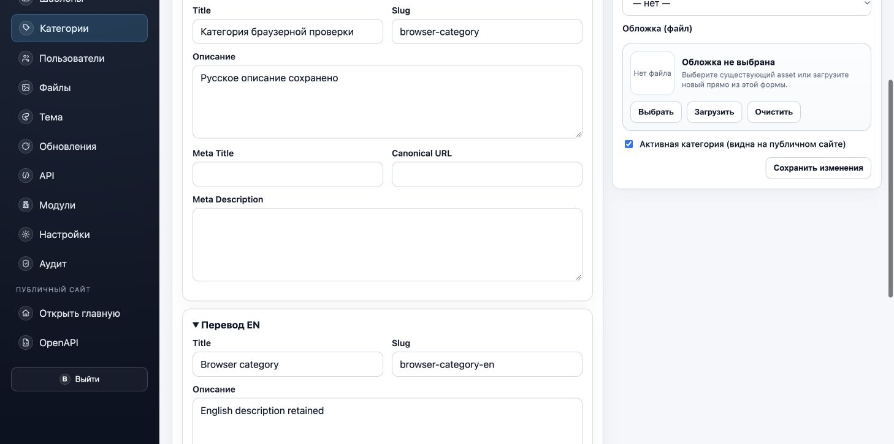

# PUB-10–17: реализация и проверка, 2 октября 2026

Изменения проверены в отдельной копии `/private/tmp/testocms-p2-pub`: собственный vendor, PHP 8.4.19 в Docker, SQLite `:memory:` для PHPUnit. Браузерная база `database/pub-browser.sqlite`, localhost:58131, искусственные публикации и учётная запись. Пользовательские `.env`, БД и storage не использовались.

## Результаты по пунктам аудита

| Пункт | Исправление | Подтверждение |
|---|---|---|
| PUB-10 | Блог читает `?page`; стабильная сортировка `published_at,id`; старый `/blog/page/N` перенаправляется 301 на канонический query URL. Категории имеют page-specific canonical. | Две разные страницы выдачи, корректные ссылки и canonical; повторный запрос с HIT; legacy 1/2; category pagination после SEO cache. В Chrome клик «Дальше» меняет статьи 1,2 на 3,4. |
| PUB-11 | Переключатель строится из доступных переводов сущности; использует реальные локализованные slug. Не копирует token/signature/query. Поиск сохраняет только q/type и сбрасывает page. | Page/post/category с разными RU/EN slug, отсутствие ссылки для untranslated post/page, запрос отсутствующего перевода — 404. Chrome RU-only page имеет только RU; поиск EN даёт 0 вместо русского fallback. |
| PUB-12 | Locale ограничивает запрос до paginate/limit. API не подставляет default translation. В DTO категории поста включены только активные категории с переводом в выбранной locale. | Page/post/category API: total=3, per_page=2 при смешанных RU/EN данных; foreign detail404; category filter inactive исключён. RSS содержит оба RU материала при 51 более позднем EN. |
| PUB-13 | `search_text`: отдельная Unicode-folded проекция авторских title/meta/body. SQLite ищет body, %/_ экранированы. Page tree рекурсивно исключает post_listing/module_widget, сниппеты получают авторский текст из того же отфильтрованного дерева. HTML/script/style очищаются; post body берётся из текущего HTML, legacy plaintext используется при отсутствии HTML. | Русские body-only фразы и Ё в любом регистре; literal100%; отсутствующие/foreignlocale результаты; nested listing snapshot не находится после unpublish исходного поста; скриптовый текст не ищется; обновление HTML удаляет старый текст из проекции; клиентский search_text не принимается. |
| PUB-14 | RSS собирается DOM XML text nodes; `&`, Unicode, `<tag>`, `]]>` и XML1.0 controls обрабатываются корректно. | DOMDocument::loadXML и точное восстановление title/description; нет невалидного CDATA. |
| PUB-15 | RSS категории требует active=true и реальный перевод; неизвестная locale — 404. | Активная категория отдаёт RSS, после деактивации — 404. |
| PUB-16 | ETag — SHA1 реально сериализованных JSON bytes. Weak/list/* поддержаны строгим разбором, substring/malformed не совпадают. Само наличие If-None-Match блокирует дату, даже при пустом значении. Composite content JSON использует digest ETag без недостоверного Last-Modified сущности. | Strong/weak/list/* → 304 с пустым body. Mismatch + будущая дата → 200. Empty/malformed header + matching date → 200. Изменение translation без изменения entity.updated_at → новые JSON/ETag200, date-only не скрывает изменение. |
| PUB-17 | Public page и stage используют один content partial. Нет автоматического hero/title/status/type/date/meta strip. Первый авторский H1 сохранён. Настроенные theme/header/footer и SEO head остаются. Блог имеет нейтральное описание вместо demo phrase; редактируемый seed content сохранён. | Реальный stage POST и public GET дают идентичный authored DOM с отключённой instrumentation, включая один H1 и header/footer. Home остаётся slug home; отсутствие опубликованной home →404. Stage private no-store/noindex. Chrome screenshot ниже. |

## Миграция и совместимость

`2026_10_02_000200_add_authored_search_projections.php` добавляет nullable `search_text`, заполняет существующие переводы пачками по 100, сохраняет `content_blocks`, `rendered_html`, `content_html`, `created_at` и `updated_at`. Для MySQL/MariaDB создаётся FULLTEXT индекс, PostgreSQL — GIN для выражения, используемого поиском. SQLite использует folded LIKE. Обновление проекции выполняется persister и model saving hook, включая demo seeds; поле серверное и не берётся из пользовательского ввода. После backfill сменяется content generation. HTML cache namespace изменён для исключения ранее отрендеренного demo шаблона; финальный единый namespace HTML/slug/SEO использует versioned CACHE_SCHEMA v3, исключающий cache от установленной P1 версии.

## Проверки

- `PublicContentCorrectnessTest`: **18 tests / 173 assertions PASS** на SQLite, [PostgreSQL](postgresql-public.log) и [MySQL](mysql-public.log). Класс использует `DatabaseMigrations`: изменения действительно commit до публичного запроса. Это необходимо для настоящей проверки InnoDB FULLTEXT, который не индексирует вставки до commit; outer transaction от `RefreshDatabase` давал бы ложные отрицательные результаты. Ожидания и поисковый production path не ослаблены.
- Существующие `PublicationSafetyTest`, `SiteSearchTest`, `ContentApiTest`, `PageStagePreviewTest` вместе с новым классом: **42 теста, 340 assertions — PASS**.
- Общая матрица root: [PHP 8.2](php82-phpunit.log) и [8.3](php83-phpunit.log) — **383 / 2118 PASS**; [PHP 8.4](php84-phpunit.log) и [8.5](php85-phpunit.log) — **383 / 2138 PASS**. Полный [PHPStan](phpstan.log) — без ошибок, [Pint](pint.log) — 464 files PASS; финальный scoped [PostgreSQL](postgresql-final.log) — 116 tests / 757 assertions PASS. Соответствие финальному снимку исходников и последующие точечные проверки фиксирует основной отчёт.
- Собственные SQLite логи: `/private/tmp/testocms-p2-pub-scoped.log`, `/private/tmp/testocms-p2-pub-committed.log`; JUnit в disposable copy `pub-junit.xml`, `pub-junit-committed.xml`.

## Browser evidence

Публичная RU-only страница: один авторский H1, авторский текст и CTA; выбранные header/footer сохранены; автометаданные/hero отсутствуют, только RU language link.

В Chrome выполнена последовательность: авторский CTA → блог → «Дальше» → page2; поиск «ёжик» через header form →5 RU результатов; клик EN →0 результатов с сохранённым q/type.

В Chrome выполнен вход в админку и создание категории с RU/EN title, slug и description. Повторное открытие edit подтвердило оба сохранённых перевода:

Дополнительный HTTP цикл на той же disposable CMS использует настоящий login, CSRF и cookie session, а не прямую запись моделей. Результаты: [структурированный протокол](admin-public-http.json).

1. Multipart PNG upload → публичный GET200, полученные bytes точно совпадают с исходным PNG.
2. Назначение category.cover_asset_id → web DELETE используемого asset заблокирован: показана ссылка на категорию и поле cover_asset_id; запись и media GET200 сохранены.
3. Очистка обложки и всех EN полей → EN translation удалён, RU title/description сохранены.
4. Повторное DELETE свободного asset → запись удалена, media GET404.
5. POST template с полностью отсутствующим description и payload `{}` → запись создана с description=null и отображается в каталоге.

Шаги HTTP 1–5 не объявляются GUI проверками. Вызов браузерного file chooser завис и был прерван; затем повторное подключение к той же вкладке завершалось ограниченными 10-second таймаутами, а Chrome binding стал недоступен. Поэтому сам chooser, удаление asset через GUI, очистка EN через GUI и template GUI остаются непроверенными. Native app fallback не запускался. Cold installer проверен root отдельным [HTTP циклом с CSRF/session](cold-wizard-http.json): неверный CSRF →419; wizard steps/review/finish →200; login/admin →200; повторный setup →404. Эта PUB проверка его fixture не изменяла; GUI cold wizard не пройден.

SQLite, PostgreSQL и MySQL paths проверены runtime. Браузерная stage instrumentation оставлена как редакторская функция; точное равенство public/stage DOM сравнивалось с instrument=false.
